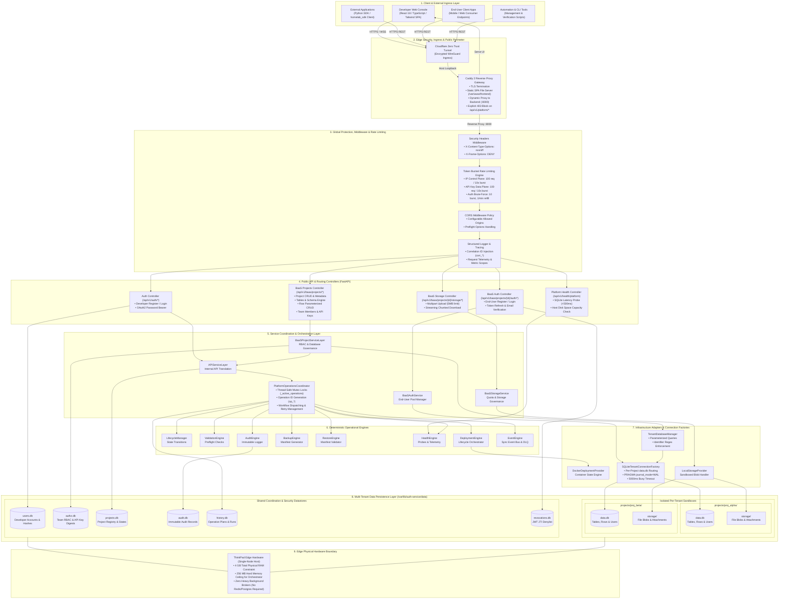
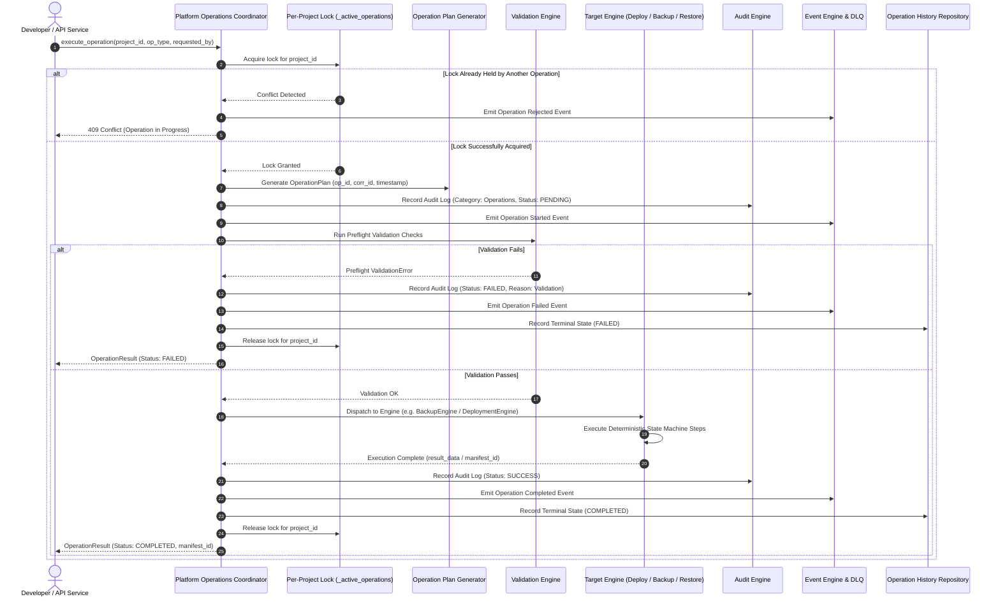
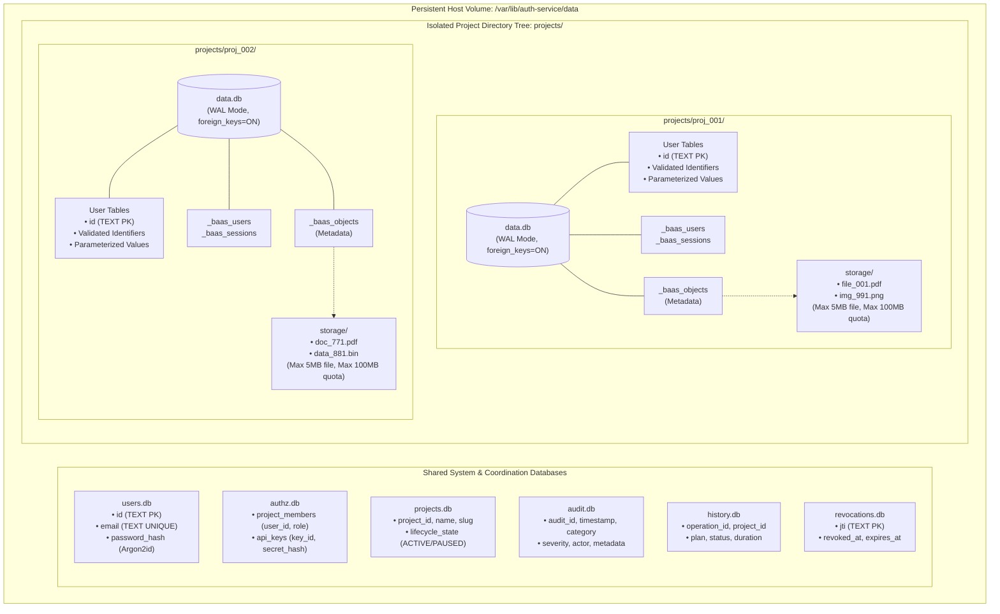
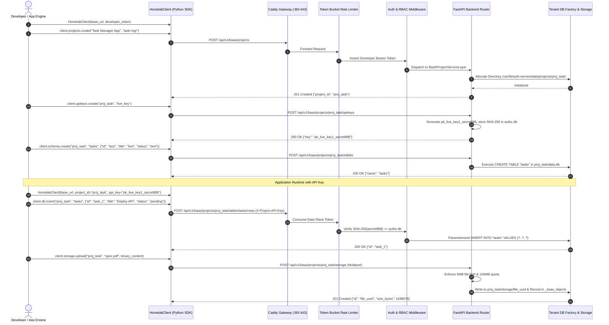
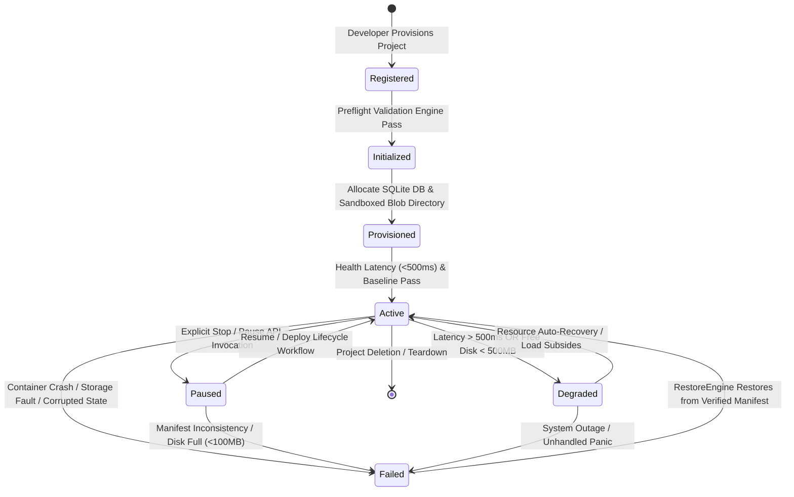

# Homelab Platform Orchestrator & Backend-as-a-Service (BaaS)

A self-hosted, multi-tenant developer platform and Backend-as-a-Service engineered specifically for resource-constrained edge environments (single-node 4 GB RAM hardware). Built from first principles to deliver robust physical tenant isolation, modular deterministic orchestration engines, relational database provisioning, local object storage, multi-role RBAC, and an external Python SDK with a strict 256 MB memory envelope.

---

## System Overview

| Parameter | Technical Specification |
|---|---|
| Platform Architecture | Three-Plane Engine/Adapter/Coordinator Model |
| Target Host Constraint | Single-Node Edge Host (4 GB RAM, 2 Cores) |
| Orchestrator Memory Limit | Strict 256 MB RAM Constraint (`docker-compose.yml`) |
| Control & Management API | FastAPI (Python 3.10+) with Pydantic Schema Validation |
| Management Dashboard | React 18, TypeScript, Vite, Tailwind CSS Single-Page Application |
| Edge Ingress & Gateway | Caddy 2 Reverse Proxy with Cloudflare Zero Trust Tunnel |
| Tenant Isolation Model | Dedicated Per-Project SQLite Database (WAL Mode) & Partitioned Blob Storage |
| Authentication Planes | Developer Management JWT, Project API Key, Project End-User Pool JWT |
| Cryptographic Standard | PyJWT HS256 Symmetric Signing, Argon2id Password Hashing, SHA-256 API Keys |
| Client SDK | Python SDK (`homelab_sdk`) with Typed Interfaces & Exception Hierarchy |
| Verification Gate | 25-Phase Rigorous Roadmap with Chaos, Load, and E2E Proofs |

---

## 1. Visual System Blueprints & Core Architectures

Homelab unifies edge reverse proxy routing, multi-tenant database sandboxing, deterministic operational state machines, and multi-plane cryptographic identity. Below are the authoritative architectural blueprints powering the platform:

---

### Blueprint 1: End-to-End Platform Architecture & Ingress Matrix



---

### Blueprint 2: Multi-Plane Cryptographic Security & Identity Boundary Lineage

```mermaid
graph TD
    subgraph Plane1 ["Management Plane (Developer & Admin)"]
        DevRequest["Developer HTTP Request"]
        DevHeader["Authorization: Bearer <Developer_JWT>"]
        JWTVerifyDev["PyJWT HS256 Verification<br/>• Secret: PLATFORM_SECRET_KEY<br/>• Enforce aud='developer'<br/>• Check Expiration (30 min)"]
        RBACResolver["RBAC Permission Matrix<br/>• Check Role in authz.db<br/>• Roles: OWNER / ADMIN / DEVELOPER / VIEWER"]
        DevOpsGranted["Management Action Permitted<br/>• Project Creation & Deletion<br/>• Team Member Invitations<br/>• Table Schema Alterations<br/>• Deployment & Backup Triggers"]
    end

    subgraph Plane2 ["Data Plane (SDK & External Applications)"]
        SDKRequest["SDK / Application Request"]
        APIKeyHeader["X-Project-API-Key: pk_live_<key_id>_<secret>"]
        KeyLookup["Authz Lookup in authz.db<br/>• Lookup key_id<br/>• Verify is_active == True<br/>• Verify key.project_id == target_project_id"]
        HashCompare["Constant-Time Hash Comparison<br/>• Compute actual_hash = SHA256(secret)<br/>• secrets.compare_digest(stored_hash, actual_hash)"]
        DataOpsGranted["Data Plane Action Permitted<br/>• Parameterized Table Row CRUD<br/>• Sandboxed File Upload / Download<br/>• Scoped to Target Project Only"]
    end

    subgraph Plane3 ["End-User Identity Plane (Consumer Users)"]
        UserRequest["Consumer End-User Request"]
        UserHeader["Authorization: Bearer <EndUser_JWT>"]
        JWTVerifyUser["PyJWT HS256 Verification<br/>• Secret: PLATFORM_SECRET_KEY<br/>• Enforce aud='end_user'<br/>• Verify project_id Claim Matches Target"]
        DenylistCheck["Revocation Check in revocations.db<br/>• Assert jti NOT in revocations.db"]
        UserOpsGranted["End-User Action Permitted<br/>• Consumer Profile Queries (/me)<br/>• Project-Isolated Consumer Data"]
    end

    DevRequest --> DevHeader --> JWTVerifyDev --> RBACResolver --> DevOpsGranted
    SDKRequest --> APIKeyHeader --> KeyLookup --> HashCompare --> DataOpsGranted
    UserRequest --> UserHeader --> JWTVerifyUser --> DenylistCheck --> UserOpsGranted
```



---

### Blueprint 3: Platform Operations Coordinator & Deterministic Engine Execution Pipeline



---

### Blueprint 4: Deterministic Multi-Tenant Physical Isolation & SQLite Engine Topology



---

### Blueprint 5: External Application (`TaskManager`) & Python SDK (`homelab_sdk`) Async Lineage



---

### Blueprint 6: 25-Phase Verification Matrix & Chaos Engineering State Machine



---

## 2. Repository Structure

```text
Homelab/
├── README.md                               # Authoritative Platform Documentation
├── core/                                   # Host Ingress and Docker Orchestration
│   ├── Caddyfile                           # Edge Routing, Header Ingestion & API Security Gate
│   ├── docker-compose.yml                  # Production Container Setup (Auth, Caddy, Cloudflare, MinIO, PG)
│   └── .env.example                        # Template Environment Configuration
│
├── auth-service/                           # Core Platform Orchestrator (FastAPI)
│   ├── Dockerfile                          # Production Multi-Stage Python Runtime
│   ├── requirements.txt                    # Core Production Dependencies
│   ├── requirements-dev.txt                # Testing and Linting Dependencies
│   ├── app/
│   │   ├── main.py                         # FastAPI App, Lifespan Hooks & Global Middleware
│   │   ├── auth.py                         # Password Hashing (Argon2id) & JWT Generation (HS256)
│   │   ├── config.py                       # Pydantic Settings & Environment Loading
│   │   ├── project_registry_manager.py     # Tenant Project Management & State Machine
│   │   ├── api/                            # HTTP Routing & Request Handlers
│   │   │   ├── auth_routes.py              # Developer Authentication Endpoints
│   │   │   ├── baas_project_routes.py      # Project, Table, Row, Team & Key Routes
│   │   │   ├── baas_auth_routes.py         # End-User Identity Pool Endpoints
│   │   │   ├── baas_storage_routes.py      # Multipart Blob Upload & Stream Download
│   │   │   ├── rate_limiter.py             # Asynchronous Token Bucket Rate Limiting
│   │   │   └── dependencies.py             # Dependency Injection & RBAC Enforcement
│   │   ├── platform/                       # Deterministic Operational Engines
│   │   │   ├── operations/                 # Coordinator, Mutex Locks & Operation Plans
│   │   │   ├── lifecycle/                  # Lifecycle Engine & State Validation
│   │   │   ├── deployment/                 # Deployment Engine & Strategy Execution
│   │   │   ├── backup/                     # Backup Engine & Manifest Tracking
│   │   │   ├── restore/                    # Restore Engine & Consistency Validation
│   │   │   ├── health/                     # SQLite Latency & Disk Space Health Probes
│   │   │   ├── audit/                      # Tamper-Evident Immutable Audit Log Engine
│   │   │   ├── events/                     # Synchronous Event Dispatcher & Bus
│   │   │   └── validation/                 # Preflight & Schema Validation Engine
│   │   ├── storage/providers/
│   │   │   ├── sqlite.py                   # Coordination SQLite Repositories
│   │   │   └── sqlite_tenant.py            # Isolated Tenant DB Manager & Connection Factory
│   │   ├── providers/
│   │   │   ├── deployment/docker_provider.py # Docker Deployment Interface Adapter
│   │   │   └── storage/local_storage.py    # Sandboxed Filesystem Blob Storage Adapter
│   │   └── observability/                  # Structured Logging, Metrics Registry & Tracing
│   │
│   ├── dashboard/                          # Management Web Console (SPA)
│   │   ├── src/
│   │   │   ├── App.tsx                     # Top-Level Router & Layout Container
│   │   │   ├── features/                   # Domain Feature Modules
│   │   │   │   ├── auth/                   # Developer Login & Signup Forms
│   │   │   │   ├── projects/               # Project Creation, Overview & Switcher
│   │   │   │   ├── database/               # Table Schema Builder & Live Data Grid
│   │   │   │   ├── storage/                # File Browser, Upload Modal & Quota Meters
│   │   │   │   ├── apikeys/                # API Key Generation & One-Time Reveal Dialog
│   │   │   │   ├── team/                   # Member Invites & RBAC Role Selector
│   │   │   │   └── deployment/             # Deployment Status, Backup Trigger & History
│   │   │   ├── contexts/                   # AuthContext & ProjectContext State Providers
│   │   │   └── hooks/                      # Custom React Hooks for API Interaction
│   │   ├── package.json                    # Dashboard Node Dependencies
│   │   └── vite.config.ts                  # Vite Build Configuration
│   │
│   ├── docs/                               # Engineering Documentation & Roadmaps
│   │   ├── MASTER_25_PHASE_ROADMAP.md      # Permanent 25-Phase Verification Control Document
│   │   ├── ARCHITECTURE_V2.md              # Validated Architecture & Engine Boundaries
│   │   ├── API_REFERENCE.md                # Comprehensive Endpoint Specification
│   │   ├── SECURITY_AND_LIMITS.md          # Cryptographic Rules, Quotas & Hardware Limits
│   │   ├── DEVELOPER_GUIDE.md              # External Application Developer Onboarding
│   │   ├── phase19_chaos_runbook.md        # Chaos Engineering & Infrastructure Resilience Runbook
│   │   ├── phase20_performance_audit.md    # 100-Project Performance Load Audit Decision
│   │   └── phase21_e2e_verification.md     # Full E2E Verification Record
│   │
│   └── tests/                              # Comprehensive Test Suite (100+ Tests)
│       ├── security/                       # Brute-force, SQL injection, IDOR & leakage tests
│       ├── performance/                    # Load generation, telemetry monitors & quota tests
│       └── integration_chaos/              # Automated fault-injection & recovery suites
│
├── sdk-python/                             # Official Homelab Python SDK (`homelab_sdk`)
│   ├── pyproject.toml                      # Standard Packaging Metadata
│   ├── homelab_sdk/
│   │   ├── client.py                       # Top-Level `HomelabClient` Entrypoint
│   │   ├── exceptions.py                   # Typed Exception Hierarchy (401, 403, 404, 429, 500)
│   │   └── api/                            # Domain Client Implementations
│   │       ├── admin.py                    # Developer Authentication & Registration
│   │       ├── projects.py                 # Project Lifecycle, Deployment, Backup & Logs
│   │       ├── teammates.py                # Member Add, List, Update & Remove
│   │       ├── apikeys.py                  # API Key Generation, Listing & Revocation
│   │       ├── schema.py                   # Table Creation & Schema Inspection
│   │       ├── db.py                       # Parameterized Row CRUD Operations
│   │       ├── storage.py                  # File Upload, Download & Deletion
│   │       └── auth.py                     # Project End-User Pool Authentication
│   └── tests/                              # SDK Unit & Platform Integration Tests
│
└── external-app/                           # Verified Real-World External Consumer Application
    ├── todo_app.py                         # `TaskManager` Standalone Domain Application
    ├── run_e2e.py                          # Full 25-Phase End-to-End Workflow Execution
    └── tests/test_todo_app.py              # Application-Level Unit Test Suite
```

---

## 3. Subsystem Deep Dives

### 1. Identity, Authentication, and RBAC

The platform establishes three segregated authentication boundaries:

```text
+---------------------------------------------------------------------------------------------------+
| MANAGEMENT PLANE (Developer Account)                                                              |
| Header: Authorization: Bearer <Developer JWT>                                                     |
| Token Claims: sub=<user_id>, aud="developer", exp=30min, jti=<uuid>                               |
| Access: Project Provisioning, Team Management, Key Generation, Deployments, Backups               |
+---------------------------------------------------------------------------------------------------+
| DATA & STORAGE PLANE (External Application)                                                       |
| Header: X-Project-API-Key: pk_live_<key_id>_<secret>                                              |
| Verification: SHA-256(secret) == authz.db[key_id].secret_hash                                     |
| Access: Scoped strictly to project tables, rows, and object storage                               |
+---------------------------------------------------------------------------------------------------+
| END-USER IDENTITY PLANE (Project Consumers)                                                       |
| Header: Authorization: Bearer <End-User JWT>                                                      |
| Token Claims: sub=<end_user_id>, aud="end_user", project_id=<proj_id>, exp=30min                  |
| Access: Isolated end-user data within the consumer application                                    |
+---------------------------------------------------------------------------------------------------+
```

#### Team Member RBAC Matrix

| Role | View Resources | Insert/Update Data | Manage Schemas | Trigger Deploy/Stop | Trigger Backup/Restore | Manage Team & Keys |
|---|---|---|---|---|---|---|
| **OWNER** | Allowed | Allowed | Allowed | Allowed | Allowed | Allowed |
| **ADMIN** | Allowed | Allowed | Allowed | Allowed | Allowed | Restricted (Cannot delete project) |
| **DEVELOPER**| Allowed | Allowed | Allowed | Allowed | Denied | Denied |
| **VIEWER** | Allowed | Denied | Denied | Denied | Denied | Denied |

---

### 2. Tenant Database Service (Data Plane)

- **Storage Engine:** Dedicated SQLite database file per project located at `/var/lib/auth-service/data/projects/{project_id}/data.db`.
- **Concurrency Mode:** Configured with `PRAGMA journal_mode=WAL` (Write-Ahead Logging) to permit simultaneous non-blocking reads while writes occur.
- **Busy Timeout:** 5,000 ms busy handler to handle concurrent write bursts gracefully without throwing lock exceptions.
- **SQL Injection Defense:**
  - Table and column names are validated strictly against `^[a-zA-Z_][a-zA-Z0-9_]{0,63}$`.
  - Reserved prefixes (`sqlite_`, `_baas_`) are forbidden for user tables.
  - All query values are bound exclusively via parameterized SQL placeholders (`?`).
- **Supported Data Types:** `TEXT`, `INTEGER`, `REAL`, `JSON` (stored internally as validated JSON text).

---

### 3. Tenant Object Storage Service

- **Storage Engine:** Sandboxed local directory storage partitioned by project: `/var/lib/auth-service/data/projects/{project_id}/storage/`.
- **Metadata Store:** Tracked in the tenant's isolated database within the `_baas_objects` table (recording file ID, original filename, MIME type, size in bytes, SHA-256 checksum, uploader ID, and creation timestamp).
- **Enforced Constraints:**
  - `storage_max_file_size_bytes`: **5 MB** per individual file upload.
  - `storage_max_project_quota_bytes`: **100 MB** total aggregated storage per project.
- **Streaming Transfer:** Large file downloads utilize chunked `StreamingResponse` streams with explicit `Content-Disposition` headers to preserve memory bounds.

---

### 4. Platform Operations Coordinator & Engines

All infrastructure and lifecycle actions run through the centralized `PlatformOperationsCoordinator`:

- **Mutual Exclusion Locking:** An internal threading lock (`_active_operations`) guarantees that only one mutating operation (deploy, backup, restore, restart) can execute on a single project at any given time, rejecting concurrent attempts with HTTP 409 Conflict.
- **Correlation & Tracing:** Every operational request is assigned an immutable `operation_id` (`op_...`) and `correlation_id` (`corr_...`), tracked across structured log events and persisted in `history.db`.
- **Reliability & Event DLQ:** Failed event dispatches are routed through an internal `DeadLetterQueue` managed by the `EventReliabilityManager` to prevent event loss.

---

### 5. Health Monitoring & Observability

- **Endpoint:** `GET /api/v1/health/platform` (also aliased at `/health`).
- **Health Evaluators:**
  - **SQLite Latency Probe:** Executes a heartbeat query against tenant databases. Latencies exceeding 500 ms trigger degraded health state.
  - **Host Disk Free Space:**
    - Space < 500 MB: System status changes to `DEGRADED`.
    - Space < 100 MB: System status changes to `UNHEALTHY` (returns HTTP 503).
- **Resource Boundary:** Continuously monitors RAM consumption to maintain compliance with the 256 MB Docker container ceiling.

---

### 6. Rate Limiting and Brute-Force Protection

The platform implements an in-memory Token Bucket algorithm with automatic Least-Recently-Used (LRU) bucket eviction (10,000 maximum tracking keys):

- **Data Plane Bucket:** 10 tokens/second refill rate, burst capacity of 100 tokens (keyed by API key).
- **Control Plane Bucket:** 10 tokens/second refill rate, burst capacity of 100 tokens (keyed by client IP).
- **Auth Brute-Force Bucket:** 1 token/minute refill rate, burst capacity of 10 attempts (keyed simultaneously by IP and normalized email identity). Successful logins automatically clear the client IP counter.

---

## 4. Python SDK Guide (`homelab-sdk`)

### 1. Installation

```bash
cd sdk-python
pip install -e .
```

### 2. Client Initialization

```python
from homelab_sdk.client import HomelabClient

# Management Plane Client (Admin / Developer)
admin_client = HomelabClient(
    base_url="https://api.yourdomain.com",
    developer_token="<DEVELOPER_BEARER_TOKEN>"
)

# Data Plane Client (Application Backend)
app_client = HomelabClient(
    base_url="https://api.yourdomain.com",
    project_id="proj_abcdef123456",
    api_key="pk_live_keyid_secrettoken"
)

# End-User Plane Client (Consumer User Context)
user_client = HomelabClient(
    base_url="https://api.yourdomain.com",
    project_id="proj_abcdef123456",
    end_user_token="<END_USER_BEARER_TOKEN>"
)
```

---

### 3. Management Plane Operations

```python
# 1. Register and Authenticate Developer
auth_res = admin_client.admin.register("dev@example.com", "lead_dev", "StrongPassword123")
login_res = admin_client.admin.login("dev@example.com", "StrongPassword123")
token = login_res["access_token"]

# 2. Provision a New Project
proj = admin_client.projects.create(name="Production API", slug="prod-api")
project_id = proj["project_id"]

# 3. Add a Teammate with RBAC Role
admin_client.teammates.add(project_id, "colleague@example.com", role="developer")

# 4. Generate a Persistent Project API Key
key_res = admin_client.apikeys.create(project_id, name="backend-service-key")
api_key = key_res["key"]  # Save this immediately; raw key is shown only once!

# 5. Define a Database Table Schema
admin_client.schema.create(
    project_id=project_id,
    table_name="orders",
    columns={
        "id": "text",
        "customer_id": "text",
        "amount": "real",
        "status": "text",
        "metadata": "json"
    }
)
```

---

### 4. Data Plane Operations (Database & Storage)

```python
# 1. Insert a Record
order_id = app_client.db.insert(
    project_id="proj_abcdef123456",
    table_name="orders",
    data={
        "id": "ord_9901",
        "customer_id": "cust_44",
        "amount": 149.99,
        "status": "pending",
        "metadata": {"source": "mobile_app", "discount": False}
    }
)

# 2. Query Records
orders = app_client.db.list(project_id="proj_abcdef123456", table_name="orders")

# 3. Update a Record
app_client.db.update(
    project_id="proj_abcdef123456",
    table_name="orders",
    row_id="ord_9901",
    data={"status": "fulfilled"}
)

# 4. Upload a File Blob (Up to 5 MB)
with open("invoice.pdf", "rb") as f:
    upload_res = app_client.storage.upload(
        project_id="proj_abcdef123456",
        filename="invoice_9901.pdf",
        content=f.read()
    )
file_id = upload_res["id"]

# 5. Download a File Blob
file_bytes = app_client.storage.download(
    project_id="proj_abcdef123456",
    file_id=file_id
)
```

---

### 5. End-User Authentication Plane

```python
# 1. Register End-User in Project Pool
app_client.auth.register(
    project_id="proj_abcdef123456",
    email="customer@example.com",
    password="CustomerPassword456"
)

# 2. Login End-User
user_session = app_client.auth.login(
    project_id="proj_abcdef123456",
    email="customer@example.com",
    password="CustomerPassword456"
)
user_jwt = user_session["access_token"]

# 3. Access Project as Authenticated End-User
user_client = HomelabClient(
    base_url="https://api.yourdomain.com",
    project_id="proj_abcdef123456",
    end_user_token=user_jwt
)
profile = user_client.auth.get_me(project_id="proj_abcdef123456")
```

---

## 5. Management Dashboard UI

The platform includes a single-page management console located in `auth-service/dashboard/`:

- **Technology Stack:** React 18, TypeScript, Vite, Tailwind CSS, Lucide Icons.
- **Capabilities:**
  - **Account & Security:** Developer login, user registration, JWT session persistence.
  - **Project Switcher:** Seamless switching across accessible tenant projects with strict role verification.
  - **Database Viewer:** Interactive table schema designer, column type selector, and live tabular data browser with insert, edit, and delete actions.
  - **Storage Manager:** Drag-and-drop file uploader, object directory inspector, size counters, and live quota usage progress bars.
  - **API Key Console:** One-time API key generator with cryptographic copy modals and revocation triggers.
  - **Team Collaboration:** Teammate invitation modal with dynamic RBAC role assignment (`OWNER`, `ADMIN`, `DEVELOPER`, `VIEWER`).
  - **Operations Console:** Real-time deployment trigger, container status indicator, health metrics viewer, and backup/restore history audit log.

```bash
# Running the Dashboard in Development Mode
cd auth-service/dashboard
npm install
npm run dev
```

---

## 6. 25-Phase Verification Roadmap & Audit

The codebase strictly complies with the authoritative 25-Phase Roadmap. Every phase follows a rigorous progression from gap analysis to real verification locks:

| Phase | Description | Key Deliverables & Validation Scope | Status |
|---|---|---|---|
| **Phase 9A** | Core Platform Engines | Platform operations coordinator, engine adapters, and state machines | [LOCKED] |
| **Phase 10** | Production Architecture | Multi-container Compose architecture and internal repository interfaces | [LOCKED] |
| **Phase 10.5**| Real Deployment Smoke Test | Initial end-to-end containerized smoke validation | [LOCKED] |
| **Phase 11** | BaaS Foundation & Multi-Tenant RBAC | User registration, project ownership, team roles (Owner/Admin/Dev/Viewer) | [LOCKED] |
| **Phase 12** | Developer API & SDK Integration | API key hashing, public route contracts, and token bucket rate limiters | [LOCKED] |
| **Phase 12.5**| Rate Limiting & DoS Protection | In-memory token bucket implementation across IP, API Key, and Auth scopes | [LOCKED] |
| **Phase 13** | Database / Data Service | Per-project SQLite databases in WAL mode, table creation, parameterized CRUD | [LOCKED] |
| **Phase 14.1**| End-User Authentication Pool | Project-isolated user identity tables (`_baas_users`), JWT audience segregation | [LOCKED] |
| **Phase 14.2**| BaaS Storage Service | Sandboxed local storage provider, 5 MB file limit, 100 MB project quota | [LOCKED] |
| **Phase 14.3**| Deployment Integration | Operations engine binding to BaaS API with mutual exclusion locks | [LOCKED] |
| **Phase 14.4**| Health & Resource Monitoring | SQLite latency probe (<500 ms) and host disk capacity monitoring | [LOCKED] |
| **Phase 15** | Security & Reliability Audit | Comprehensive security boundaries, failure recovery, and audit trails | [LOCKED] |
| **Phase 16** | Dashboard / Frontend | React 18 / TypeScript SPA console with database, storage, and key management | [LOCKED] |
| **Phase 17** | Ingress & Edge Routing | Caddy reverse proxy, Cloudflare tunnel routing, and internal port blocking | [LOCKED] |
| **Phase 18** | Security Hardening Audit | Adversarial verification of SQLi, IDOR, brute force, headers, and secret leaks | [LOCKED] |
| **Phase 19** | Reliability & Chaos Testing | Chaos runbook: container kills, network disconnects, daemon crashes, graceful restart | [LOCKED] |
| **Phase 20** | Performance & Quota Testing | 100-project burst load test (1,410 requests, 84.5 ms p50, 0 errors, 256 MB cap) | [LOCKED] |
| **Phase 21** | External App E2E Verification | Standalone `TaskManager` CLI app validating full workflow via `homelab-sdk` | [LOCKED] |
| **Phase 22** | Integration Sprint & Bug Fixes | Backup/restore state tracking fixes and schema synchronization hardening | [LOCKED] |
| **Phase 23** | Production Readiness Hardening | Dependency audit, code cleanup, strict memory limits, and logging redaction | [LOCKED] |
| **Phase 24** | Product Documentation | Complete developer guides, API references, security guides, and deployment docs | [LOCKED] |
| **Phase 25** | Final Release Verification | Final comprehensive release verification gate and permanent artifact lock | [LOCKED] |

---

## 7. Deployment & Getting Started

### Prerequisites

- **Host OS:** Linux (Ubuntu 22.04+ recommended) or Windows with WSL2 / Docker Desktop
- **Hardware:** Minimum 1 Core CPU, 1 GB available RAM (Optimized for 4 GB RAM total system memory)
- **Software:** Docker (v20.10+) and Docker Compose (v2.0+)

---

### Local Installation & Startup

```bash
# 1. Clone the repository
git clone https://github.com/sharancode3/Homelab.git
cd Homelab

# 2. Build the Dashboard Frontend Assets
cd auth-service/dashboard
npm install
npm run build
cd ../..

# 3. Configure Environment Variables
cp core/.env.example core/.env
# Edit core/.env and set your PLATFORM_SECRET_KEY and domain configurations

# 4. Start the Entire Platform Stack
cd core
docker compose up -d --build

# 5. Verify Running Containers
docker compose ps
```

---

### Environment Variables

| Variable | Default | Description |
|---|---|---|
| `PLATFORM_ENVIRONMENT` | `production` | Deployment mode (`development`, `staging`, `production`) |
| `PLATFORM_DEBUG` | `false` | Enable verbose debug logging |
| `PLATFORM_API_HOST` | `0.0.0.0` | Bind host for FastAPI backend |
| `PLATFORM_API_PORT` | `8000` | Internal bind port for FastAPI |
| `PLATFORM_STORAGE_PATH` | `/var/lib/auth-service/data` | Persistent host volume path for all tenant databases and blobs |
| `PLATFORM_SECRET_KEY` | *(Required in Production)* | Cryptographic secret key for HS256 JWT signing and internal tokens |
| `CORS_ALLOWED_ORIGINS` | `*` | Comma-separated list of permitted browser origins |

---

### Health and Readiness Verification

Verify the system is running and reporting healthy state:

```bash
# Check platform readiness
curl -s http://localhost/health

# Inspect detailed system & disk health metrics
curl -s http://localhost/api/v1/health/platform
```

Expected JSON Response:
```json
{
  "status": "healthy",
  "version": "1.0.0",
  "checks": {
    "sqlite_latency_ms": 1.42,
    "disk_free_mb": 24580,
    "disk_status": "OK"
  }
}
```

---

## 8. Security Invariants & Compliance

1. **No Plaintext Secrets:** Passwords are consistently hashed using Argon2id with automatic salt generation. Raw API keys (`pk_live_***`) are generated once and only stored as SHA-256 digests.
2. **Explicit Cryptographic Algorithm:** JWT tokens strictly enforce `HS256`. Asymmetric fallback and none-algorithm bypasses are strictly prevented by PyJWT validation settings.
3. **Audience Segregation:** Management tokens (`aud="developer"`) cannot be utilized against end-user endpoints, and end-user tokens (`aud="end_user"`) cannot access developer or project administration APIs.
4. **Host Port Protection:** Internal database, cache, and backend ports are never exposed to the public network. Public ingress is mediated entirely by Caddy and Cloudflare Zero Trust.
5. **Memory Constraint Guarantee:** The Platform Orchestrator process is locked to a maximum memory ceiling of `256M` in `docker-compose.yml`, preventing memory exhaustion or host destabilization.

---

## 9. License

This project is licensed under the MIT License. See [LICENSE](LICENSE) for details.


